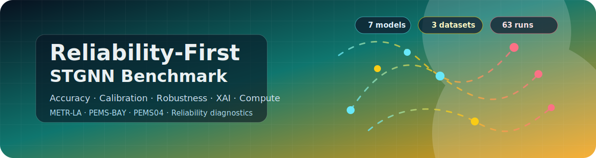
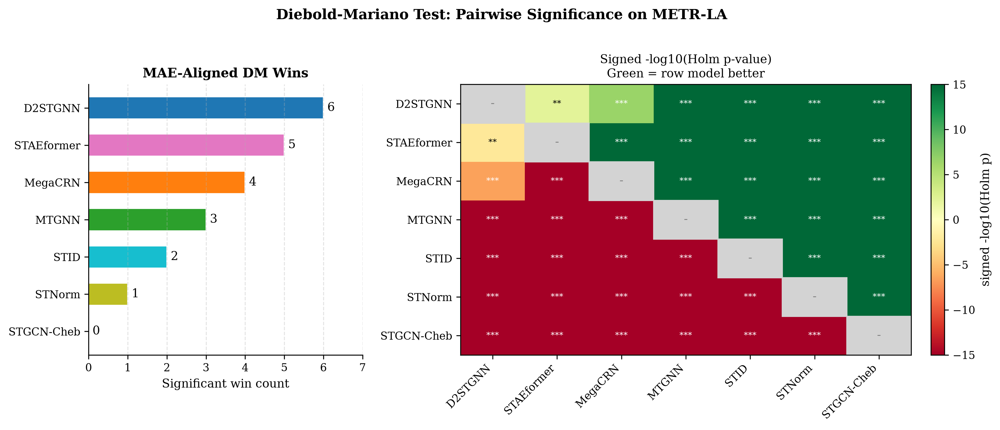

# Reliability-First STGNN Benchmark

<p align="center">
  
</p>

<p align="center">
  <a href="#quick-start"></a>
  <a href="#compute-environment"></a>
  <a href="#compute-environment"></a>
  <a href="#models"></a>
  <a href="#benchmark-scope"></a>
  <a href="#license"></a>
</p>

<p align="center">
  <a href="#overview">Overview</a> |
  <a href="#benchmark-scope">Scope</a> |
  <a href="#models">Models</a> |
  <a href="#result-gallery">Result Gallery</a> |
  <a href="#compute-environment">Compute</a> |
  <a href="#quick-start">Quick Start</a> |
  <a href="#key-artifacts">Artifacts</a>
</p>

Repository for:

**Reliability-First Spatio-Temporal Graph Forecasting: A Survey and Traffic-Domain Benchmark for Calibration, Robustness, and Explanation Diagnostics**

## Overview

This repository provides the code structure, configurations, figures, and compact result artifacts for a traffic-domain reliability benchmark of spatio-temporal graph neural network forecasting models. The benchmark compares models beyond point accuracy by adding statistical testing, uncertainty calibration, robustness checks, explanation diagnostics, and computational cost.

<table>
  <tr>
    <td align="center" width="25%"><strong>7 models</strong><br/>Graph recurrent, convolutional, normalization, identity, and transformer families</td>
    <td align="center" width="25%"><strong>3 traffic datasets</strong><br/>METR-LA, PEMS-BAY, and PEMS04 under a shared benchmark protocol</td>
    <td align="center" width="25%"><strong>63 traffic runs</strong><br/>3 datasets x 7 models x 3 seeds, with 100 epochs per run</td>
    <td align="center" width="25%"><strong>Reliability suite</strong><br/>Accuracy, statistics, uncertainty, robustness, XAI, and compute</td>
  </tr>
</table>

## Benchmark Scope

The main benchmark is intentionally focused on traffic forecasting. Appendix-only sanity artifacts are kept separate from the traffic-domain ranking.

| Dataset | Role | Coverage |
|---|---|---|
| METR-LA | Primary diagnostic traffic dataset | Full reliability suite |
| PEMS-BAY | Traffic-domain transfer check | Point forecasting and selected diagnostics |
| PEMS04 | Traffic-domain transfer check | Point forecasting, bootstrap sensitivity, and selected diagnostics |

## Models

| Model | Family |
|---|---|
| D2STGNN | Decoupled dynamic spatial-temporal GNN |
| MegaCRN | Memory-augmented recurrent graph model |
| MTGNN | Multivariate temporal graph neural network |
| STNorm | Spatial-temporal normalization baseline |
| STGCN-Cheb | Chebyshev spectral graph convolution baseline |
| STID | Lightweight spatial-temporal identity baseline |
| STAEformer | Adaptive embedding transformer |

## Result Gallery

<table>
  <tr>
    <td align="center" width="50%">
      <br/>
      <sub><strong>Point forecasting.</strong> Mean test MAE over seeds 43, 44, and 45.</sub>
    </td>
    <td align="center" width="50%">
      <br/>
      <sub><strong>Statistical distinguishability.</strong> METR-LA pairwise DM analysis with Holm-adjusted p-values.</sub>
    </td>
  </tr>
  <tr>
    <td align="center" width="50%">
      <br/>
      <sub><strong>Uncertainty quantification.</strong> Per-horizon conformal calibration diagnostics.</sub>
    </td>
    <td align="center" width="50%">
      <br/>
      <sub><strong>Explanation diagnostics.</strong> Cross-method stability and agreement patterns.</sub>
    </td>
  </tr>
</table>

## Results

### Point Forecasting

Mean test MAE over seeds 43, 44, and 45:

| Model | METR-LA | PEMS-BAY | PEMS04 |
|---|---:|---:|---:|
| D2STGNN | **2.878** | **1.513** | 18.393 |
| STAEformer | 2.942 | 1.573 | **18.222** |
| MegaCRN | 3.011 | 1.551 | 18.819 |
| MTGNN | 3.021 | 1.591 | 19.059 |
| STID | 3.119 | 1.563 | 18.419 |
| STNorm | 3.132 | 1.603 | 19.042 |
| STGCN-Cheb | 3.137 | 1.702 | 19.963 |

### METR-LA DM Significance

The METR-LA pairwise Diebold-Mariano analysis uses Holm-adjusted p-values across the 21 model pairs:

```text
results/task1_point_forecasting/dm_metrla_21pairs_mae_aligned.json
```

Left in the gallery figure: significant win counts by model. Right in the gallery figure: signed `-log10` Holm-adjusted p-values. Green cells indicate that the row model has lower MAE; gray cells are not significant at 0.05 after Holm adjustment.

<details>
<summary>Reproduce the DM figure</summary>

```bash
python scripts/generate_pf3_dm_significance.py
```

</details>

### Dependence-Aware Bootstrap

Forecast-origin block-bootstrap sensitivity checks are provided for METR-LA and PEMS04:

```text
results/task1_point_forecasting/block_bootstrap_dm_robustness_metr-la_seeds43-44-45.csv
results/task1_point_forecasting/block_bootstrap_dm_robustness_pems04_seeds43-44-45.csv
```

These checks complement the flattened DM matrix by resampling one-day forecast-origin blocks.

### Uncertainty Quantification

The conformal analysis is reported for the selected D2STGNN base forecaster, with global and per-horizon variants.

### Explanation Diagnostics

XAI artifacts include GNNExplainer deletion fidelity, perturbation stability, Integrated Gradients, attention diagnostics, and cross-method agreement. The METR-LA MTGNN case study and reduced cross-dataset transfer summary are stored in:

```text
results/task3_explainability/case_studies/
```

## Compute Environment

The main traffic benchmark was run as a multi-seed GPU experiment. Post-hoc analysis scripts can be run on CPU when prediction and result artifacts are already available.

| Item | Reference setup / usage |
|---|---|
| Main GPU | NVIDIA GeForce RTX 4090, 24 GB VRAM |
| CPU / memory | AMD Ryzen 9 7900X, 12 cores / 24 threads, 64 GB RAM |
| CUDA / PyTorch | CUDA 12.6, PyTorch 2.11.0+cu126 |
| Main framework | BasicTS + EasyTorch 1.3.3 |
| Python stack | Python 3.9, NumPy 1.24.4, TensorBoard 2.18.0, PyG >= 2.3.0, SciPy >= 1.10, Captum >= 0.6 |
| Traffic training budget | 63 trained runs: 3 datasets x 7 models x 3 seeds, 100 epochs per run |
| Seeds | 43, 44, 45 |
| Forecasting setting | 12 input steps to 12 output steps |
| DM / bootstrap / figures | Post-hoc artifact scripts; GPU not required with stored results |

Wall-clock time depends on dataset storage, dataloader settings, GPU availability, and whether checkpoints or prediction dumps are already present.

## Repository Layout

```text
configs/                         Model/dataset/seed experiment configs
datasets/                        Dataset metadata and download notes
figures/
  main/                          Main manuscript figures
  appendix/                      Supplementary diagnostic figures
  readme/                        README visual assets
models/                          Local model architecture implementations
pipelines/                       End-to-end task entry points
results/
  task1_point_forecasting/       Point forecasting, DM, bootstrap artifacts
  task2_uncertainty/             UQ and conformal artifacts
  task3_explainability/          XAI and stability artifacts
  nontraffic_graph_sanity/       Chickenpox appendix sanity-check artifacts
scripts/                         Reproduction, figure, and diagnostic scripts
src/                             Shared reliability utilities
```

## Quick Start

The repository is organized so readers can inspect the published artifacts without retraining the traffic models. For local script execution, create the environment with either:

```bash
pip install -r requirements.txt
```

or:

```bash
conda env create -f environment.yml
conda activate stgnn-benchmark
```

Full traffic-model retraining requires the original datasets, trained-checkpoint storage, and GPU resources.

## Key Artifacts

| Area | Location |
|---|---|
| Point forecasting, DM, and bootstrap results | [`results/task1_point_forecasting/`](results/task1_point_forecasting/) |
| Uncertainty and conformal diagnostics | [`results/task2_uncertainty/`](results/task2_uncertainty/) |
| XAI summaries and case-study artifacts | [`results/task3_explainability/`](results/task3_explainability/) |
| Main manuscript figures | [`figures/main/`](figures/main/) |
| Reproduction and utility scripts | [`scripts/`](scripts/) |

## Citation

```bibtex
@misc{ahmad2026reliability,
  title  = {Reliability-First Spatio-Temporal Graph Forecasting: A Survey and
            Traffic-Domain Benchmark for Calibration, Robustness, and
            Explanation Diagnostics},
  author = {Ahmad, Hussein and Mortazavi, Seyyed Kasra and Benarbia, Taha
            and Al Machot, Fadi and Kyamakya, Kyandoghere},
  year   = {2026},
  note   = {Manuscript prepared for IEEE Access submission}
}
```

## License

This project is released under the MIT License. See `LICENSE`.
