# STGNN Reliability Benchmark

### Calibration, Robustness, and Explanation Diagnostics for Spatio-Temporal Graph Neural Networks in Traffic Forecasting

Companion repository for the manuscript: *"Reliability-First Spatio-Temporal Graph Forecasting: A Survey and Traffic-Domain Benchmark for Calibration, Robustness, and Explanation Diagnostics"* — prepared for IEEE Access submission.

---

## Table of Contents

1. [Overview](#overview)
2. [Benchmark Design](#benchmark-design)
3. [Datasets](#datasets)
4. [Models](#models)
5. [Main Results](#main-results)
   - [Task 1 — Point Accuracy & Statistical Significance](#task-1--point-accuracy--statistical-significance)
   - [Task 2 — Uncertainty Quantification & Calibration](#task-2--uncertainty-quantification--calibration)
   - [Task 3 — Explainability & Stability](#task-3--explainability--stability)
6. [Appendix / Supplementary Diagnostics](#appendix--supplementary-diagnostics)
7. [Repository Structure](#repository-structure)
8. [Quick Start](#quick-start)
9. [Pre-Computed Results](#pre-computed-results)
10. [Known Scope Limitations](#known-scope-limitations)
11. [Authors](#authors)
12. [Citation](#citation)

---

## Overview

Despite rapid progress in Spatio-Temporal Graph Neural Networks (STGNNs) for traffic forecasting, existing evaluations focus almost exclusively on point-accuracy metrics (MAE, RMSE, MAPE), leaving three critical reliability dimensions understudied: **calibration** of predictive uncertainty, **robustness** to distribution shifts, and **consistency** of explanations. This repository provides code, configurations, precomputed results, and publication-quality figures for a systematic evaluation of **7 state-of-the-art STGNNs** across these three dimensions on **three real-world traffic datasets**. Full retraining requires downloading the original public datasets and sufficient GPU resources (~72 GPU-hours).

<p align="center">
  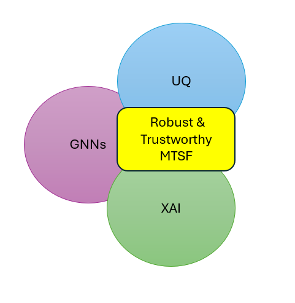
</p>
<p align="center"><em>The three underexplored reliability dimensions — calibration, robustness, and explainability — addressed by this benchmark.</em></p>

<p align="center">
  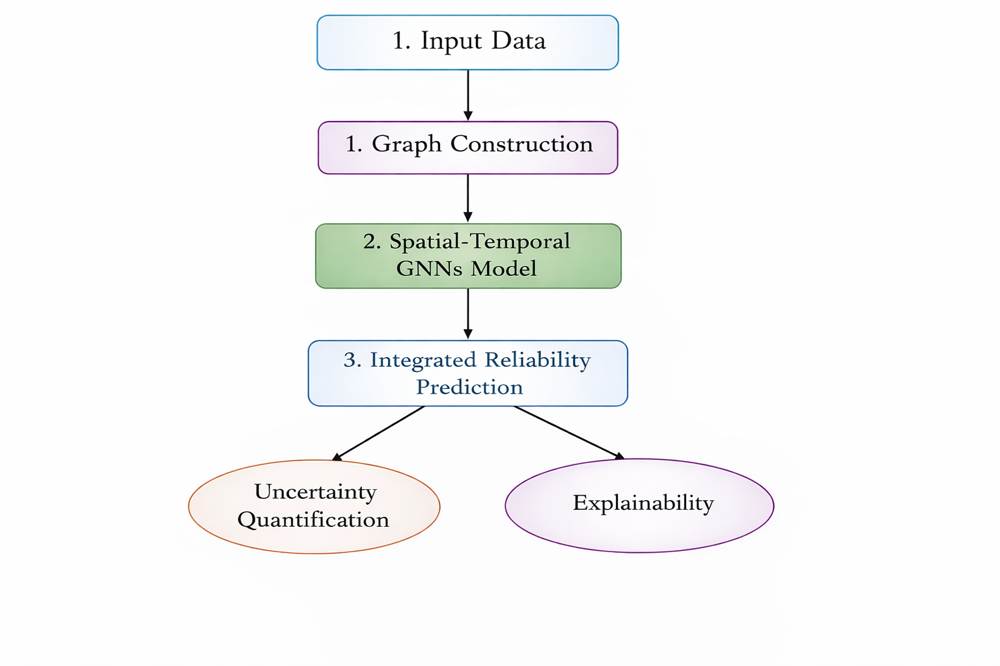
</p>
<p align="center"><em>End-to-end benchmark pipeline: from multi-seed training to reliability evaluation across three tasks.</em></p>

<p align="center">
  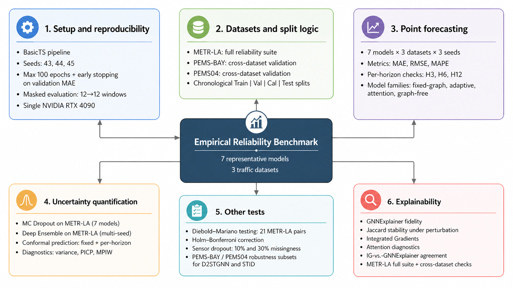
</p>
<p align="center"><em>Mapping of reliability evaluation tasks to models and datasets.</em></p>

---

## Benchmark Design

| Task | Reliability Dimension | Evaluation Protocol |
|------|-----------------------|---------------------|
| **Task 1** | Point Accuracy & Statistical Significance | Multi-seed evaluation (seeds 43/44/45), Diebold-Mariano test (21 pairs, Holm-Bonferroni correction) |
| **Task 2** | Uncertainty Quantification & Calibration | MC Dropout (50-pass), Deep Ensemble (3 seeds), Split-Conformal Prediction (fixed + per-horizon) |
| **Task 3** | Explainability & Stability | GNNExplainer + Jaccard Stability, Integrated Gradients, Temporal Attention, Cross-method Agreement |

---

## Datasets

| Dataset | Sensors | Time Steps | Frequency | Location | Split (train/val/test) | Source |
|---------|---------|------------|-----------|----------|------------------------|--------|
| METR-LA | 207 | ~34,272 | 5 min | Los Angeles, CA | 70/10/20% | Li et al. \[1\] |
| PEMS-BAY | 325 | ~52,116 | 5 min | San Francisco Bay Area, CA | 70/10/20% | Li et al. \[1\] |
| PEMS04 | 307 | ~16,992 | 5 min | Guangdong Province, China | 60/20/20% | Song et al. \[2\] |

<p align="center">
  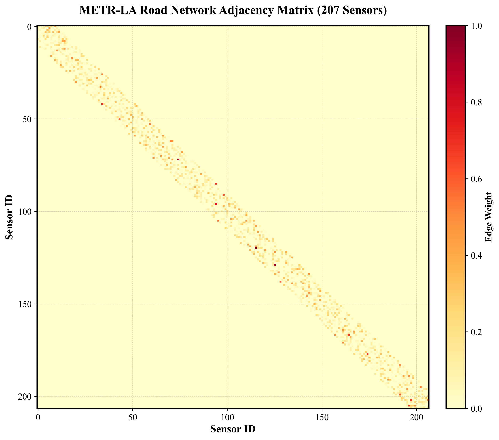
</p>
<p align="center"><em>METR-LA road network adjacency matrix (207 sensors, distance-based thresholded Gaussian kernel).</em></p>

See [`datasets/README.md`](datasets/README.md) for download instructions.

**References:**

\[1\] Y. Li, R. Yu, C. Shahabi, and Y. Liu, "Diffusion Convolutional Recurrent Neural Network: Data-Driven Traffic Forecasting," in *Proc. Int. Conf. Learn. Represent. (ICLR)*, 2018.

\[2\] C. Song, Y. Lin, S. Guo, and H. Wan, "Spatial-Temporal Synchronous Graph Convolutional Networks: A New Framework for Spatial-Temporal Network Data Forecasting," in *Proc. AAAI Conf. Artif. Intell.*, vol. 34, pp. 914–921, 2020.

---

## Models

| Model | Architecture | Key Feature | Reference |
|-------|-------------|-------------|-----------|
| D2STGNN | Diffusion + Spectral GNN | Decoupled spatial-temporal dynamics | Shao et al. \[3\] |
| MegaCRN | Memory-augmented GCN + RNN | Adaptive memory bank | Jiang et al. \[4\] |
| MTGNN | Multi-scale temporal GNN | Dilated temporal convolutions | Wu et al. \[5\] |
| STNorm | Spatial-Temporal Normalization | Instance + group normalization | Deng et al. \[6\] |
| STGCNChebGraphConv | Chebyshev spectral GCN | Spectral graph convolution | Yu et al. \[7\] |
| STID | Spatial-Temporal Identity | Lightweight MLP + spatial/temporal IDs | Shao et al. \[8\] |
| STAEformer | Adaptive Embedding Transformer | Attention with learned node embeddings | Liu et al. \[9\] |

### Complexity (METR-LA, single forward pass, batch=1, T=12)

| Model | Params | GFLOPs |
|-------|-------:|-------:|
| STGCNChebGraphConv | 246 K | 0.016 |
| STID | 118 K | 0.042 |
| MTGNN | 405 K | 0.177 |
| STNorm | 224 K | 0.310 |
| D2STGNN | 392 K | 0.881 |
| MegaCRN | 389 K | 0.001 |
| STAEformer | 1,259 K | 5.120 |

**References:**

\[3\] Z. Shao, Z. Zhang, W. Wei, F. Wang, Y. Xu, X. Cao, and C. S. Jensen, "Decoupled Dynamic Spatial-Temporal Graph Neural Network for Traffic Forecasting," *Proc. VLDB Endow.*, vol. 15, no. 11, pp. 2733–2746, 2022.

\[4\] R. Jiang, Z. Wang, J. Yong, P. Jeph, Q. Chen, Y. Kobayashi, X. Song, S. Fukushima, and T. Suzumura, "Spatio-Temporal Meta-Graph Learning for Traffic Forecasting," in *Proc. AAAI Conf. Artif. Intell.*, vol. 37, no. 7, pp. 8078–8086, 2023.

\[5\] Z. Wu, S. Pan, G. Long, J. Jiang, X. Chang, and C. Zhang, "Connecting the Dots: Multivariate Time Series Forecasting with Graph Neural Networks," in *Proc. ACM SIGKDD Int. Conf. Knowl. Discov. Data Min.*, pp. 753–763, 2020.

\[6\] C. Deng, X. Wang, Z. Jiang, W. Zhang, W. Luo, and J. Wang, "ST-Norm: Spatial and Temporal Normalization for Multi-Variate Time Series Forecasting," in *Proc. ACM SIGKDD Int. Conf. Knowl. Discov. Data Min.*, pp. 269–278, 2021.

\[7\] B. Yu, H. Yin, and Z. Zhu, "Spatio-Temporal Graph Convolutional Networks: A Deep Learning Framework for Traffic Forecasting," in *Proc. Int. Joint Conf. Artif. Intell. (IJCAI)*, pp. 3634–3640, 2018.

\[8\] Z. Shao, Z. Zhang, F. Wang, W. Wei, and Y. Xu, "Spatial-Temporal Identity: A Simple yet Effective Baseline for Multivariate Time Series Forecasting," in *Proc. ACM Int. Conf. Inf. Knowl. Manag. (CIKM)*, pp. 4727–4731, 2022.

\[9\] C. Liu, S. Sun, J. Wang, Y. Zhang, and J. Bi, "STAEformer: Spatio-Temporal Adaptive Embedding Makes Vanilla Transformer SOTA for Traffic Forecasting," in *Proc. ACM Int. Conf. Inf. Knowl. Manag. (CIKM)*, pp. 4125–4129, 2023.

---

## Main Results

> These figures and tables correspond directly to the **main text** of the manuscript. Supplementary diagnostic plots are in the [Appendix](#appendix--supplementary-diagnostics) section below.

### Task 1 — Point Accuracy & Statistical Significance

Multi-seed evaluation across 3 random seeds (43, 44, 45). All metrics reported as mean ± std on the test split. **Bold** = best per dataset.

| Model | METR-LA | PEMS-BAY | PEMS04 |
|-------|--------:|----------:|-------:|
| D2STGNN | **2.878** ± 0.001 | **1.513** ± 0.001 | 18.393 ± 0.043 |
| STAEformer | 2.942 ± 0.006 | 1.573 ± 0.013 | **18.222** ± 0.094 |
| MegaCRN | 3.011 ± 0.035 | 1.551 ± 0.003 | 18.819 ± 0.020 |
| MTGNN | 3.021 ± 0.006 | 1.591 ± 0.005 | 19.059 ± 0.022 |
| STID | 3.119 ± 0.004 | 1.563 ± 0.000 | 18.419 ± 0.010 |
| STNorm | 3.132 ± 0.003 | 1.603 ± 0.001 | 19.042 ± 0.074 |
| STGCNChebGraphConv | 3.137 ± 0.000 | 1.702 ± 0.009 | 19.963 ± 0.085 |

<p align="center">
  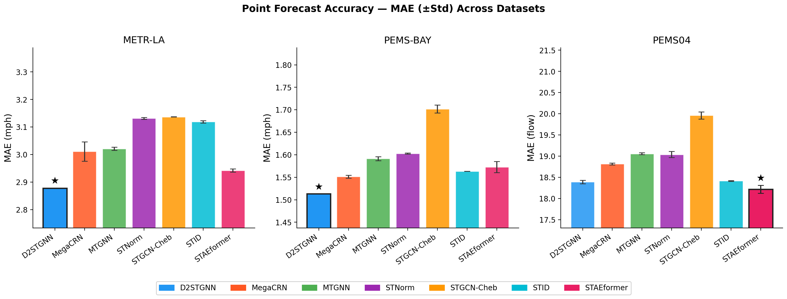
</p>
<p align="center"><em>Cross-dataset MAE comparison (mean ± std over 3 seeds). Lower is better.</em></p>

<p align="center">
  
</p>
<p align="center"><em>Diebold-Mariano pairwise significance matrix (21 pairs, Holm-Bonferroni corrected, METR-LA). Color = statistically significant winner at α = 0.05.</em></p>

### Task 2 — Uncertainty Quantification & Calibration

<p align="center">
  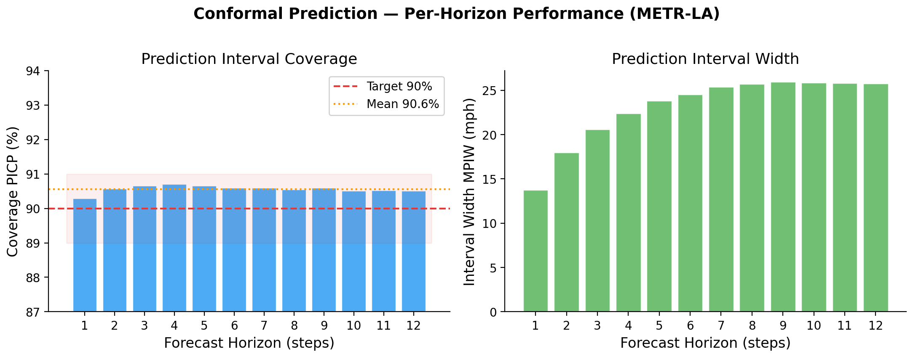
</p>
<p align="center"><em>Split-conformal prediction interval coverage and width per forecast horizon (METR-LA). Dashed line = 90% target coverage.</em></p>

### Task 3 — Explainability & Stability

<p align="center">
  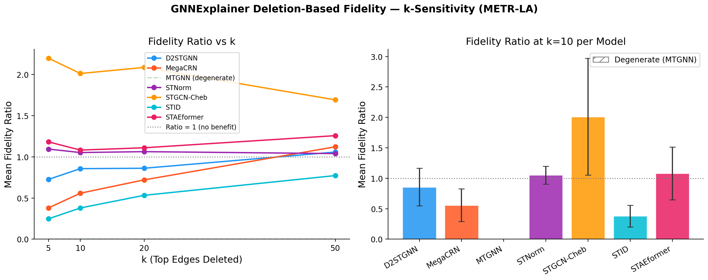
</p>
<p align="center"><em>GNNExplainer fidelity (deletion score) at k = 5, 10, 20, 50 across 7 models (METR-LA).</em></p>

<p align="center">
  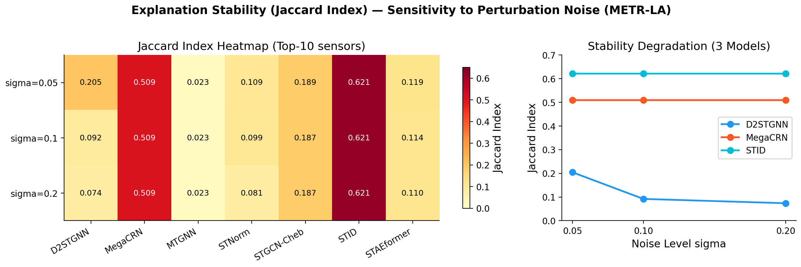
</p>
<p align="center"><em>Top-K explanation stability (Jaccard index) across repeated runs — 5 models. Higher = more consistent explanations.</em></p>

<p align="center">
  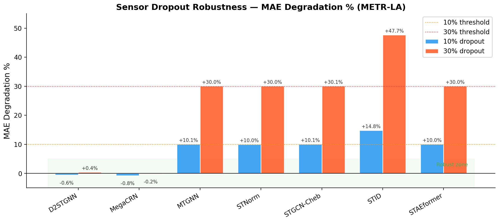
</p>
<p align="center"><em>Sensor dropout robustness — MAE degradation when top-K important sensors are masked at test time.</em></p>

---

## Appendix / Supplementary Diagnostics

> The following figures provide additional evidence, sensitivity analyses, and cross-dataset generalization checks. They support the main text claims but are not part of the core argument.

### Task 1 — Additional Horizon Analysis

<p align="center">
  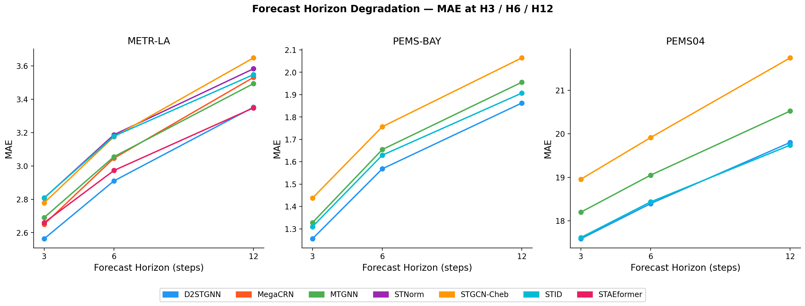
</p>
<p align="center"><em>MAE degradation across forecast horizons H1–H12 on METR-LA.</em></p>

### Task 2 — Additional UQ Diagnostics

<p align="center">
  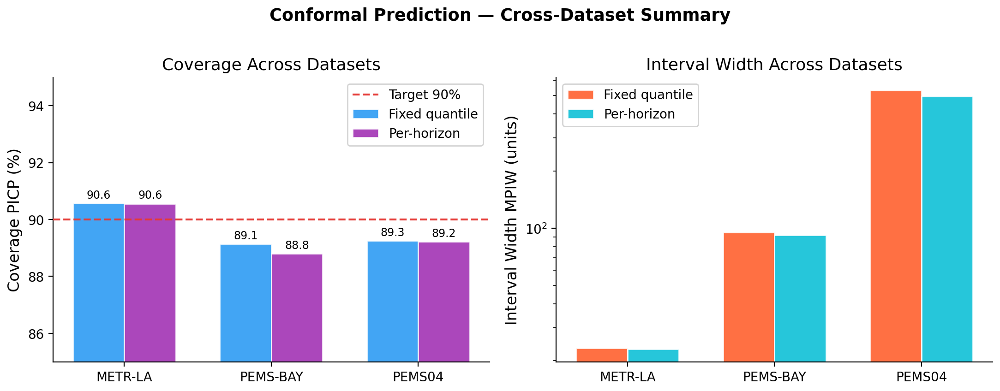
</p>
<p align="center"><em>Conformal prediction interval coverage across all three datasets.</em></p>

<p align="center">
  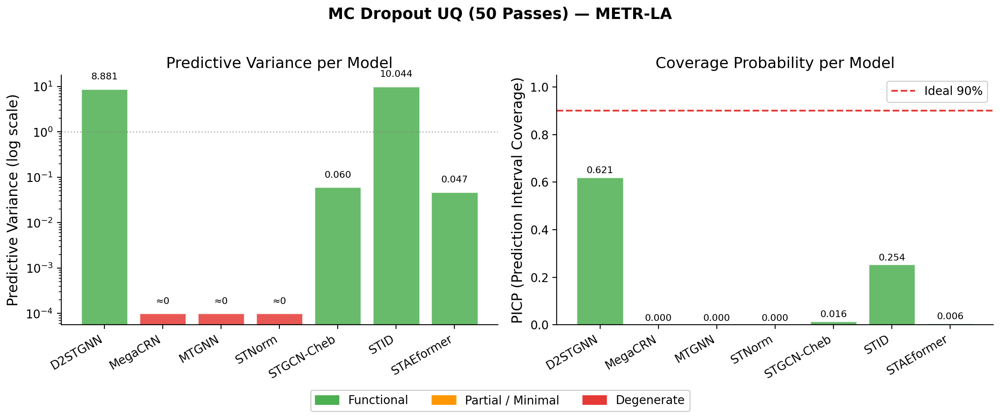
</p>
<p align="center"><em>MC Dropout (50-pass) — predictive variance vs. PICP across models (METR-LA).</em></p>

<p align="center">
  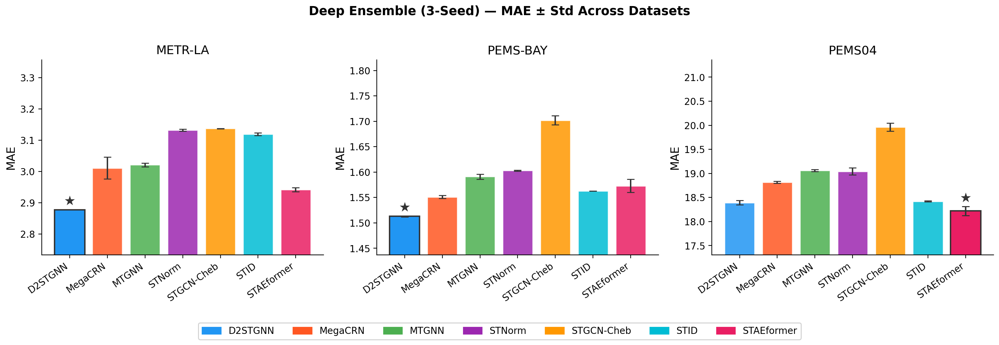
</p>
<p align="center"><em>Deep Ensemble (3 seeds) — MAE and epistemic uncertainty across all models and datasets.</em></p>

<p align="center">
  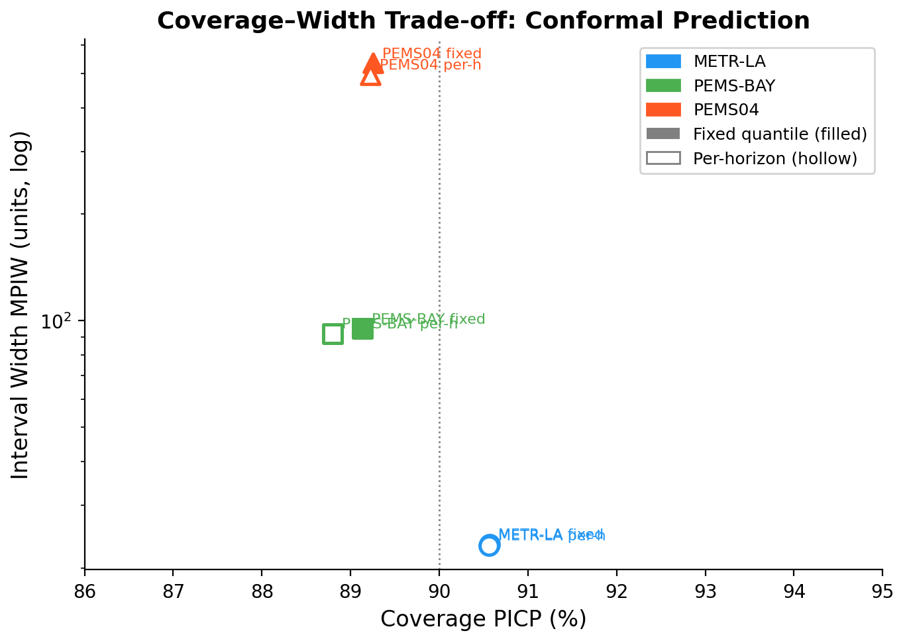
</p>
<p align="center"><em>Coverage-width trade-off for conformal prediction intervals across models.</em></p>

<p align="center">
  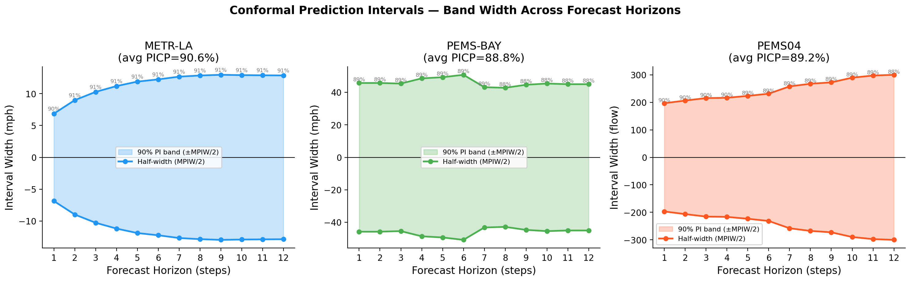
</p>
<p align="center"><em>Prediction interval width per forecast horizon for selected models.</em></p>

<p align="center">
  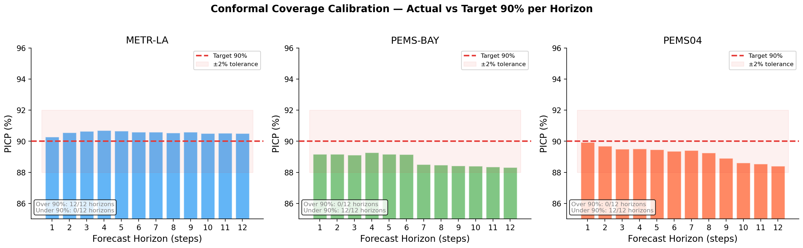
</p>
<p align="center"><em>Prediction interval coverage calibration — empirical vs. nominal coverage level.</em></p>

<p align="center">
  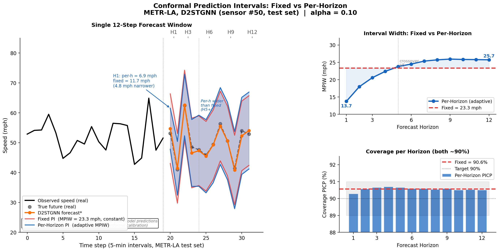
</p>
<p align="center"><em>Forecast fan chart — 50%, 80%, and 90% prediction intervals for selected models.</em></p>

### Task 3 — Additional XAI Diagnostics

<p align="center">
  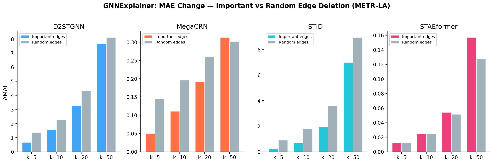
</p>
<p align="center"><em>GNNExplainer fidelity delta comparison across models and k values.</em></p>

<p align="center">
  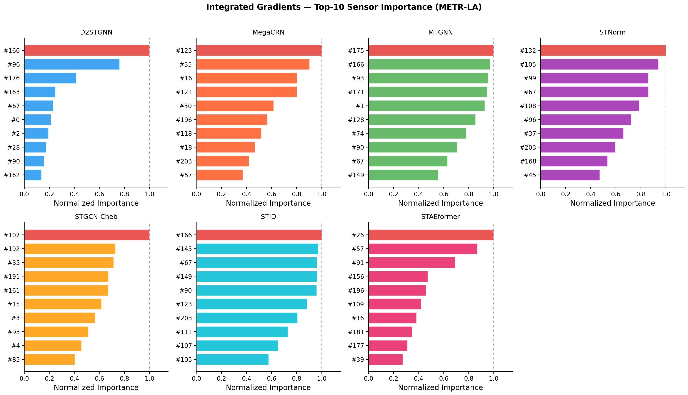
</p>
<p align="center"><em>Integrated Gradients — top-10 most important sensors per model (METR-LA).</em></p>

<p align="center">
  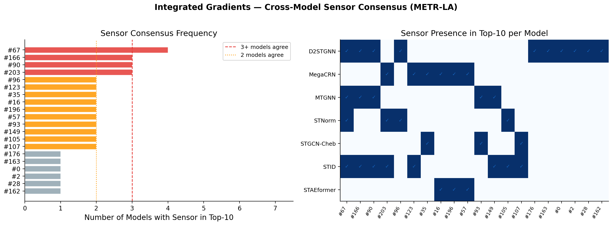
</p>
<p align="center"><em>Integrated Gradients sensor importance consensus across models.</em></p>

<p align="center">
  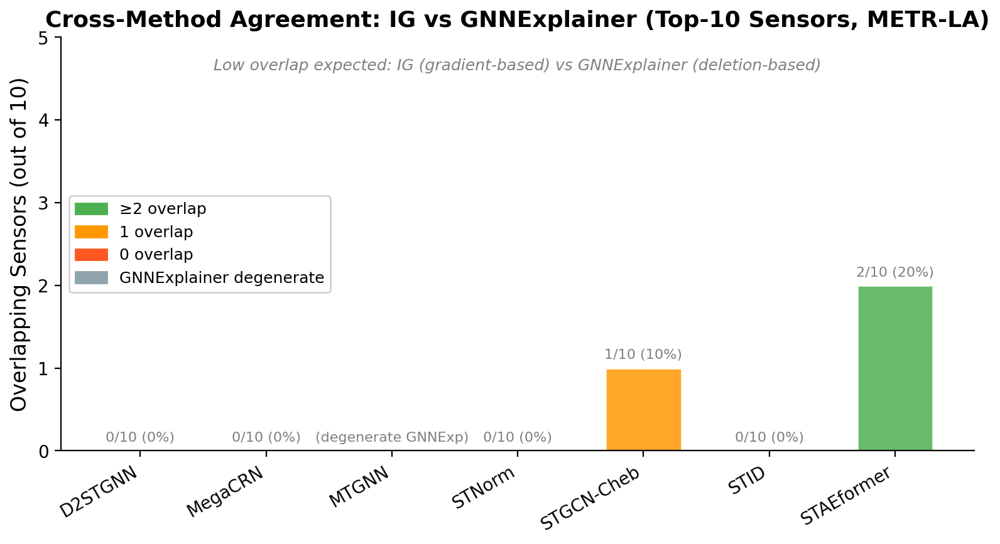
</p>
<p align="center"><em>Cross-method agreement between Integrated Gradients and GNNExplainer top-10 sensor attributions.</em></p>

<p align="center">
  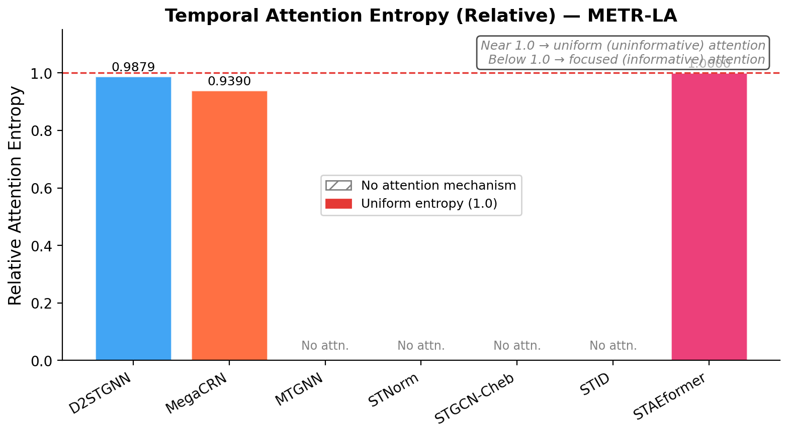
</p>
<p align="center"><em>Temporal attention entropy across models — lower entropy indicates more focused temporal attention.</em></p>

<p align="center">
  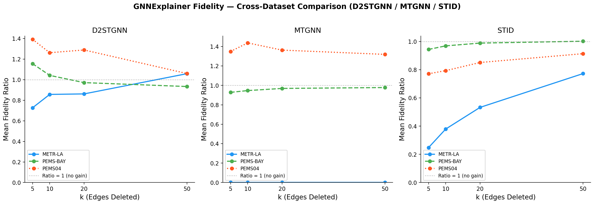
</p>
<p align="center"><em>Cross-dataset fidelity generalization — GNNExplainer evaluated on PEMS-BAY and PEMS04.</em></p>

<p align="center">
  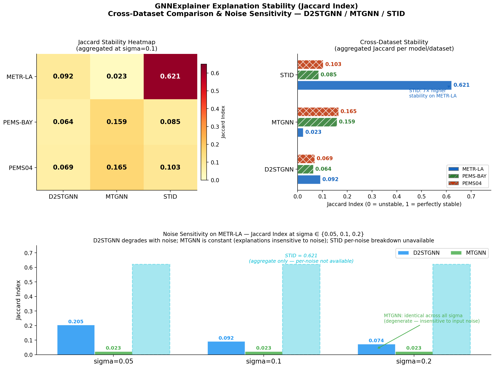
</p>
<p align="center"><em>Cross-dataset Jaccard stability comparison across all three datasets.</em></p>

<p align="center">
  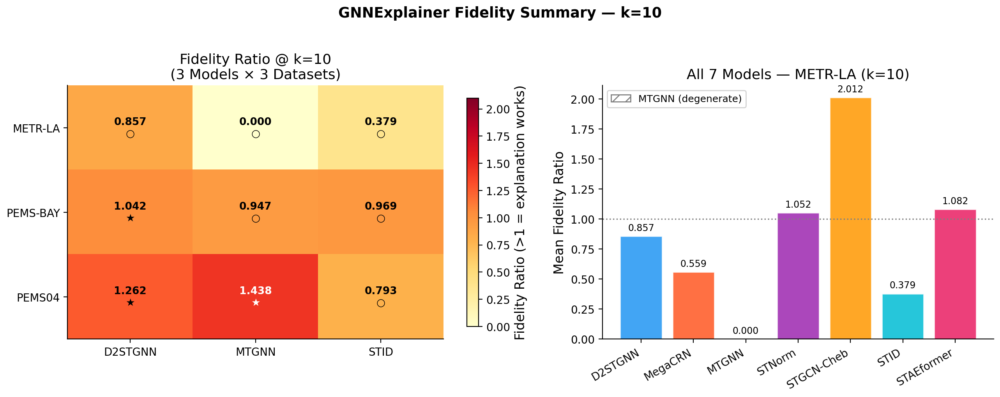
</p>
<p align="center"><em>Fidelity summary grid — GNNExplainer scores across all models and datasets.</em></p>

---

## Repository Structure

```
STGNN-Reliability-Benchmark/
|-- models/                         # 7 STGNN architecture implementations
|   |-- D2STGNN/arch/
|   |-- MegaCRN/arch/
|   |-- MTGNN/arch/
|   |-- STNorm/arch/
|   |-- STGCNChebGraphConv/arch/
|   |-- STID/arch/
|   +-- STAEformer/arch/
|-- framework/basicts/              # BasicTS training framework (vendored)
|-- configs/                        # 63 training configs (7 models x 3 datasets x 3 seeds)
|   +-- {MODEL}/{DATASET}_seed{N}.py
|-- src/                            # Core evaluation source code
|   |-- uncertainty/                # MC Dropout, Deep Ensemble, Conformal Prediction
|   +-- explainability/             # GNNExplainer, Integrated Gradients, Attention
|-- pipelines/                      # End-to-end evaluation entry points
|   |-- task1_run.py                # Training + Diebold-Mariano statistical tests
|   |-- task2_run.py                # Uncertainty quantification pipeline
|   +-- task3_run.py                # Explainability evaluation pipeline
|-- scripts/                        # Utility and recomputation scripts
|-- results/                        # All pre-computed results (JSON)
|   |-- task1_point_forecasting/
|   |-- task2_uncertainty/
|   +-- task3_explainability/
|-- figures/
|   |-- main/                       # Figures in the main manuscript text
|   +-- appendix/                   # Supplementary / appendix diagnostic figures
|-- datasets/                       # Dataset metadata (adjacency matrix, descriptions)
|   +-- {DATASET}/{adj_mx.pkl, desc.json, meta.json}
|-- environment.yml                 # Conda environment specification
+-- requirements.txt                # pip dependencies
```

---

## Quick Start

### 1. Install dependencies

```bash
# Option A — pip
pip install -r requirements.txt

# Option B — conda (recommended for reproducibility)
conda env create -f environment.yml
conda activate stgnn-benchmark
```

### 2. Download datasets

The `datasets/` directory contains metadata only (adjacency matrices, split configs). Raw `.npy` data files must be downloaded from the original sources — see [`datasets/README.md`](datasets/README.md) for full instructions.

```
datasets/METR-LA/{train,val,test}_data.npy    (207 sensors, source: DCRNN / Li et al. 2018)
datasets/PEMS-BAY/{train,val,test}_data.npy   (325 sensors, source: DCRNN / Li et al. 2018)
datasets/PEMS04/{train,val,test}_data.npy     (307 sensors, source: STSGCN / Song et al. 2020)
```

### 3. Reproduce results

**Option A — Use pre-computed results** *(no GPU required)*

All results are in `results/` as JSON files, ready to use directly for analysis or figure reproduction.

**Option B — Re-run training** *(requires GPU, ~72 GPU-hours)*

```bash
# Train all 63 configurations
python pipelines/task1_run.py --mode train

# Train a single configuration
python pipelines/task1_run.py --mode train --model D2STGNN --dataset METR-LA --seed 43
```

**Option C — Re-run evaluation only** *(requires trained checkpoints)*

```bash
python pipelines/task2_run.py --method all   # Uncertainty quantification
python pipelines/task3_run.py --method all   # Explainability evaluation
```

---

## Pre-Computed Results

All results are stored as JSON and fully traceable to the figures above.

| Task | Description | Key File(s) |
|------|-------------|-------------|
| Task 1 | Multi-seed MAE/RMSE/MAPE aggregation | `results/task1_point_forecasting/multiseed_aggregation_clean.json` |
| Task 1 | Diebold-Mariano test (21 pairs, Holm-Bonferroni) | `results/task1_point_forecasting/dm_full_21pairs_holm_corrected.json` |
| Task 2 | Split-conformal prediction metrics | `results/task2_uncertainty/conformal/{DATASET}_conformal_{variant}_metrics.json` |
| Task 2 | MC Dropout (50-pass) calibration | `results/task2_uncertainty/mc_dropout/{MODEL}_mc_dropout_50pass.json` |
| Task 2 | Deep Ensemble MAE per model | `results/task2_uncertainty/deep_ensemble/METR-LA_ensemble_metrics.json` |
| Task 3 | GNNExplainer fidelity at k = 5/10/20/50 | `results/task3_explainability/gnnexplainer/{MODEL}/METR-LA_fidelity_metrics.json` |
| Task 3 | Jaccard explanation stability (5 models) | `results/task3_explainability/jaccard_stability/{MODEL}_METR-LA_stability_metrics.json` |
| Task 3 | IG vs. GNNExplainer cross-method agreement | `results/task3_explainability/statistical_tests/ig_vs_gnn_agreement_7models.json` |

---

## Known Scope Limitations

| Item | Description |
|------|-------------|
| IG cross-dataset | Integrated Gradients computed for METR-LA only; GNNExplainer covers all 3 datasets |
| Jaccard stability | Reported for 5 models; MegaCRN and STID excluded due to methodological inconsistency in their original computation |
| Deep ensemble | Per-model ensemble MAE reported for METR-LA; full epistemic uncertainty decomposition requires trained checkpoints |
| Checkpoints | 63 trained model weights not tracked in git (large files) — available on request |

---

## Authors

Hussein Ahmad¹\*, Seyyed Kasra Mortazavi¹, Taha Benarbia², Fadi Al Machot³, and Kyandoghere Kyamakya¹\*

¹ University of Klagenfurt (AAU), Klagenfurt, Austria
² University of Oran 2 Mohamed Ben Ahmed, Oran, Algeria
³ Norwegian University of Life Sciences (NMBU), Ås, Norway

\* Corresponding authors

---

## Citation

```bibtex
@misc{ahmad2026reliability,
  title  = {Reliability-First Spatio-Temporal Graph Forecasting: A Survey and
            Traffic-Domain Benchmark for Calibration, Robustness, and
            Explanation Diagnostics},
  author = {Ahmad, Hussein and Mortazavi, Seyyed Kasra and Benarbia, Taha
            and Al Machot, Fadi and Kyamakya, Kyandoghere},
  year   = {2026},
  note   = {Manuscript prepared for IEEE Access submission}
}
```

---

## License

See `LICENSE` for details.
