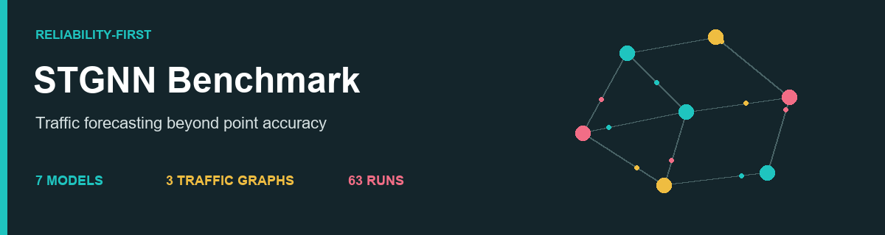
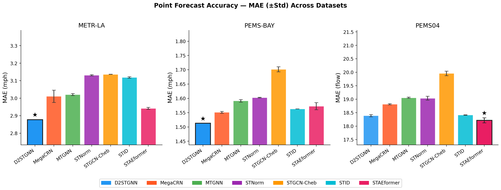
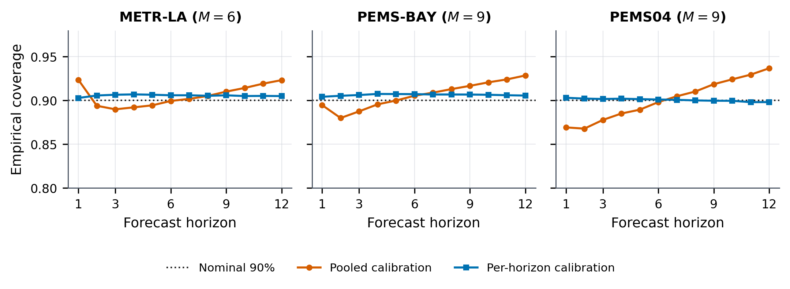
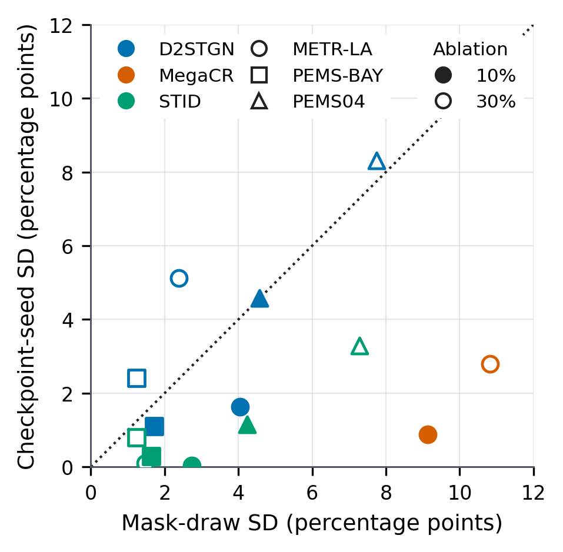
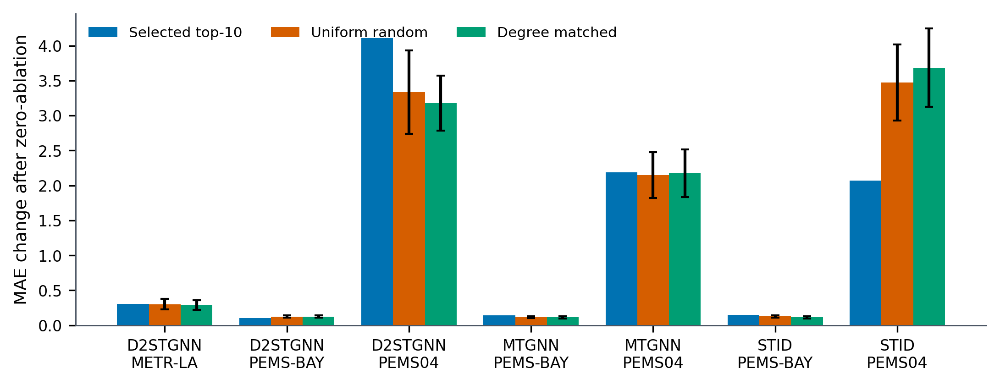

# Reliability-First STGNN Benchmark

<p align="center"></p>

<p align="center">
  <a href="https://github.com/Hussein-Ahmad-Ahmad/Reliability-First-STGNN-Benchmark/actions/workflows/verify.yml"></a>
  <a href="https://github.com/Hussein-Ahmad-Ahmad/Reliability-First-STGNN-Benchmark/tree/v1.4.1"></a>
  
  
  <a href="LICENSE"></a>
</p>

<p align="center"><strong>Accuracy · Calibration · Robustness · Explanation · Compute</strong></p>
<p align="center"><a href="RESULTS.md">Explore results</a> &nbsp; | &nbsp; <a href="configs/">Configurations</a> &nbsp; | &nbsp; <a href="REPRODUCIBILITY_CHECK.md">Verify artifacts</a> &nbsp; | &nbsp; <a href="CITATION.cff">Cite</a></p>

Seven architecture-configuration pairs on **METR-LA, PEMS-BAY, and PEMS04**, with seeds **43/44/45**. Reliability diagnostics cover the disclosed subsets and pipelines, rather than a fully crossed comparison of every method on every dataset.

## Results At A Glance

Mean test MAE across three seeds; lower is better.

| Model | METR-LA | PEMS-BAY | PEMS04 |
|---|---:|---:|---:|
| D2STGNN | **2.878** | **1.513** | 18.393 |
| STAEformer | 2.942 | 1.573 | **18.222** |
| MegaCRN | 3.011 | 1.551 | 18.819 |
| MTGNN | 3.021 | 1.591 | 19.059 |
| STID | 3.119 | 1.563 | 18.419 |
| STNorm | 3.132 | 1.603 | 19.042 |
| STGCN-Cheb | 3.137 | 1.702 | 19.963 |

<table>
<tr><td width="50%"><p align="center"><strong>Point Forecasting</strong></p></td><td width="50%"><p align="center"><strong>Horizon-Wise Calibration</strong></p></td></tr>
<tr><td width="50%"><p align="center"><strong>Sensor Zero-Ablation</strong></p></td><td width="50%"><p align="center"><strong>Explanation Diagnostics</strong></p></td></tr>
</table>

Browse [benchmark results](RESULTS.md) for compact metrics, analysis outputs, and protocol details.

## Quick Start

```bash
pip install -r requirements.txt
python scripts/verify_release.py --expect-tests 16
```

Checks cover public-file integrity and compact-result consistency. Traffic training and array-dependent post-processing additionally require original datasets, checkpoints, and retained prediction arrays; these large files are not distributed here.

| Browse | Location |
|---|---|
| Results and plots | [RESULTS.md](RESULTS.md) |
| Model configurations | [configs/](configs/) |
| Analysis utilities | [scripts/](scripts/) |
| SHA-256 inventory | [ARTIFACT_MANIFEST.sha256](ARTIFACT_MANIFEST.sha256) |
| License and citation | [MIT](LICENSE) · [CITATION.cff](CITATION.cff) |
